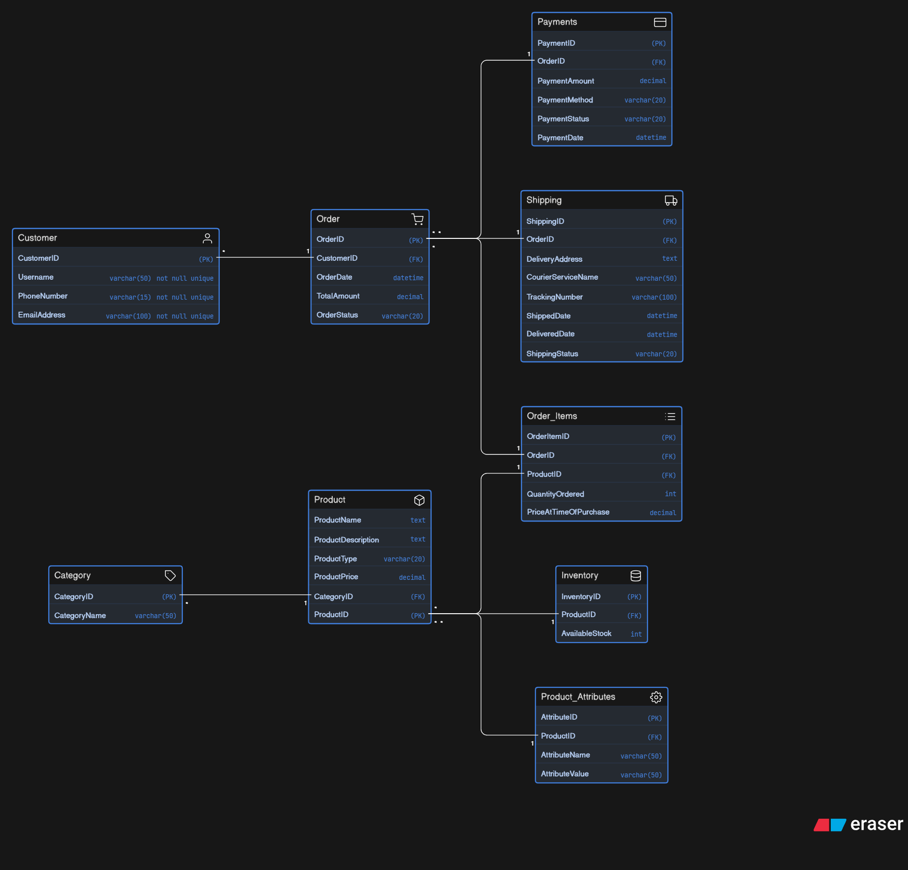

# 📦 Instagram Thrift & Handmade Store – ER Diagram

## 📖 Project Overview

This project presents the **Entity-Relationship (ER) Diagram** for a growing small business that sells **thrifted fashion items** and **handmade products** through Instagram and WhatsApp.

Initially managed manually via DMs, the business now requires a structured system to handle:

- Product management  
- Inventory tracking  
- Customer records  
- Order processing  
- Payment tracking  
- Shipping and delivery  

This ER diagram models a **real-world scalable database design** for such a platform.

---

## 🎯 Objectives

The database is designed to answer key business questions:

- What products are being sold?  
- Are they thrifted or handmade?  
- How many pieces are available?  
- Which customer placed which order?  
- What items are included in each order?  
- Was the order paid for?  
- Has the order been shipped or delivered?  
- Can one customer place multiple orders?  
- Can one order contain multiple products?  
- How to store product-specific details like size, color, and condition?  

---

## 🧠 Business Understanding

This system supports two types of products:

- **Thrifted Products**
  - Usually unique (single piece)
  - Stock is typically **1**

- **Handmade Products**
  - Can be produced in multiple quantities
  - Stock can be **greater than 1**

---

## 🗂️ Entities in the System

- **Customer**  
- **Product**  
- **Category**  
- **Inventory**  
- **Order**  
- **Order_Items**  
- **Payments**  
- **Shipping**  
- **Product_Attributes**  

---

## 🔗 Relationships & Cardinality

- One **Customer** → Many **Orders** (1:M)  
- One **Order** → Many **Order Items** (1:M)  
- One **Product** → Many **Order Items** (1:M)  
- One **Order** ↔ Many **Products** (M:M via Order_Items)  
- One **Product** → One **Inventory** (1:1)  
- One **Order** → One **Payment** (1:1)  
- One **Order** → One **Shipping** (1:1)  
- One **Category** → Many **Products** (1:M)  
- One **Product** → Many **Attributes** (1:M)  

---

## ⚙️ Database Design Highlights

- **Order_Items** resolves many-to-many relationship between Orders and Products  
- **Product_Attributes** allows flexible storage of attributes like size, color, condition  
- **Inventory** tracks available stock for each product  
- **ProductType** distinguishes thrifted and handmade items  
- **Payments** and **Shipping** are linked to Orders (not Customers)  

---

## 🖼️ ER Diagram

---
