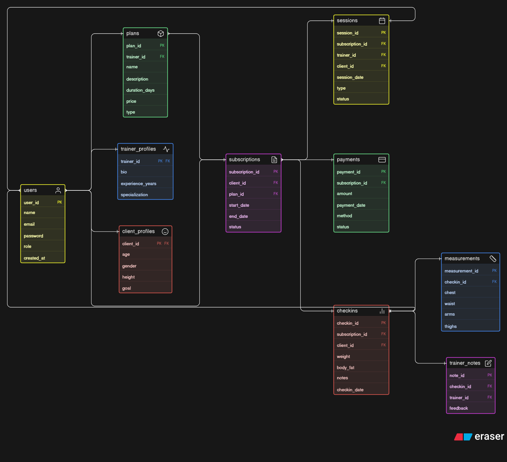

# 🏋️‍♂️ Fitness Coaching Platform – ER Diagram

> 🚀 Designed as part of a database system design project focusing on a real-world online fitness coaching ecosystem.

---

## 📖 Overview

This project represents the **Entity-Relationship (ER) Diagram** for an online fitness coaching platform where trainers manage multiple clients, provide structured coaching plans, schedule sessions, and track client progress.

Unlike traditional gym systems, this platform focuses on **remote coaching**, supporting:

* Consultation-based users
* Long-term coaching clients
* Progress tracking and feedback systems

---

## 🚀 Features

* 👤 User management (Trainer & Client roles)
* 📦 Plan creation (coaching, diet, workout, consultation)
* 🔁 Subscription system (client purchases plans)
* 📅 Session scheduling (video calls, live sessions)
* 📊 Progress tracking (weekly check-ins)
* 📏 Body measurements tracking
* 🧠 Trainer feedback & notes
* 💳 Payment tracking system

---

## 🧠 Core Entities

| Entity               | Description                                  |
| -------------------- | -------------------------------------------- |
| **Users**            | Stores all users (trainer or client)         |
| **Trainer Profiles** | Additional trainer-specific details          |
| **Client Profiles**  | Stores client fitness data                   |
| **Plans**            | Coaching programs created by trainers        |
| **Subscriptions**    | Tracks which client purchased which plan     |
| **Sessions**         | Scheduled consultations or training sessions |
| **Check-ins**        | Weekly progress updates                      |
| **Measurements**     | Detailed body stats                          |
| **Trainer Notes**    | Trainer feedback on progress                 |
| **Payments**         | Payment transactions                         |

---

## 🔗 Relationships Overview

* One **Trainer → Many Plans**
* One **Client → Many Subscriptions**
* One **Plan → Many Clients**
* One **Subscription → Many Sessions**
* One **Subscription → Many Check-ins**
* One **Check-in → One Measurement**
* One **Check-in → Many Trainer Notes**
* One **Subscription → Many Payments**

---

## 🧩 Design Highlights

* ✅ Proper **normalization** (no redundant data)
* ✅ Clear separation of:

  * User data
  * Plan data
  * Progress tracking
* ✅ Handles both:

  * Consultation-only users
  * Full coaching clients
* ✅ Scalable and practical for real-world applications
* ✅ Clean PK/FK relationships

---

## 📊 ER Diagram

> 📌 Make sure your ER diagram image is saved as **`erd.png`** in the root folder.

---

## 🛠️ Tech / Tools Used

* 🧠 Database Design Concepts
* 🎨 Eraser.io (ER Diagram Tool)

---

## 🎯 Use Case

This system can be used by:

* Fitness influencers starting online coaching
* Personal trainers managing remote clients
* Platforms offering structured fitness programs

---

## 📌 Conclusion

This ER diagram provides a strong foundation for building a scalable fitness coaching platform, supporting subscriptions, sessions, and detailed progress tracking while maintaining clean and efficient data relationships.

---

## 🙌 Author

**Mohit Kumar**

---
