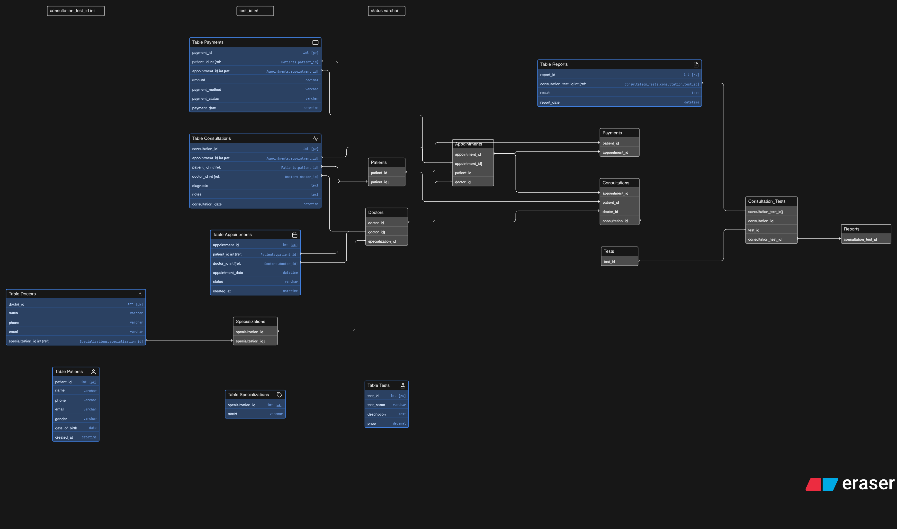

# Clinic Management System – Database Design

## Overview

The **Clinic Management System** is a database design project that models the workflow of a real clinic.
It manages patient records, doctor information, appointment scheduling, consultations, diagnostic tests, reports, and payments.

The goal of this project is to design a **normalized relational database** that accurately represents the clinic workflow from **patient registration to diagnostic reporting and payment processing**.

---

## System Workflow

The system follows the typical clinic process:

1. **Patient Registration**

   * Patients are stored in the system with their personal details.

2. **Appointment Scheduling**

   * Patients book appointments with doctors.

3. **Doctor Consultation**

   * During the appointment, the doctor records diagnosis and notes.

4. **Diagnostic Tests**

   * Doctors may prescribe tests for the patient.

5. **Test Reports**

   * Diagnostic results are stored and linked to the consultation.

6. **Payment Processing**

   * Payments are recorded for appointments or services provided.

---

## Entities in the System

The database includes the following main entities:

### Patients

Stores patient personal information.

Attributes:

* patient_id (PK)
* name
* phone
* email
* gender
* date_of_birth
* created_at

---

### Doctors

Stores doctor details and specialization.

Attributes:

* doctor_id (PK)
* name
* phone
* email
* specialization_id (FK)

---

### Specializations

Defines doctor specialties.

Attributes:

* specialization_id (PK)
* name

---

### Appointments

Handles appointment bookings between patients and doctors.

Attributes:

* appointment_id (PK)
* patient_id (FK)
* doctor_id (FK)
* appointment_date
* status
* created_at

---

### Consultations

Stores information about the patient consultation.

Attributes:

* consultation_id (PK)
* appointment_id (FK)
* patient_id (FK)
* doctor_id (FK)
* diagnosis
* notes
* consultation_date

---

### Tests

Stores diagnostic test information.

Attributes:

* test_id (PK)
* test_name
* description
* price

---

### Consultation_Tests

Junction table connecting consultations and tests.

Attributes:

* consultation_test_id (PK)
* consultation_id (FK)
* test_id (FK)
* status

---

### Reports

Stores diagnostic test results.

Attributes:

* report_id (PK)
* consultation_test_id (FK)
* result
* report_date

---

### Payments

Handles payment records for appointments.

Attributes:

* payment_id (PK)
* patient_id (FK)
* appointment_id (FK)
* amount
* payment_method
* payment_status
* payment_date

---

## Entity Relationship Diagram (ERD)

Below is the ER diagram representing the database structure and relationships.

---

## Key Relationships

* **Patient -> Appointment** : One patient can book many appointments.
* **Doctor -> Appointment** : One doctor can handle many appointments.
* **Appointment -> Consultation** : Each appointment leads to a consultation.
* **Consultation -> Tests** : A consultation may require multiple tests.
* **Tests -> Reports** : Each test generates a diagnostic report.
* **Appointment -> Payment** : Payments are linked to appointments.

---

## Database Design Features

* Proper **Primary Key (PK)** and **Foreign Key (FK)** usage
* **Normalized schema** to avoid redundancy
* Realistic modeling of clinic workflow
* Junction table used for **many-to-many relationships**
* Scalable structure for future expansion

---

## Technologies Used

* Database Design
* ER Modeling
* Relational Database Concepts
* SQL Schema Planning

---

## Possible Future Improvements

* Add **user authentication (admin/staff login)**
* Include **doctor experience and qualifications**
* Add **patient address and emergency contact**
* Implement **billing breakdown for multiple services**

---

## Author

**Mohit Kumar N**

Project created as part of a **Database Management System (DBMS) design assignment**.
