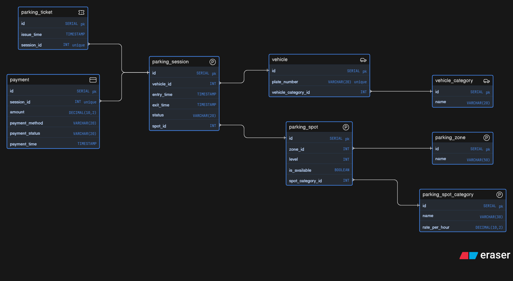

# 🚗 Parking Management System (Database Design)

This project represents a **Parking Management System Database Design** for handling vehicle parking efficiently across multiple zones and categories.

---

## 📌 Overview

The system is designed to manage:

* Vehicle entry & exit
* Parking spot allocation
* Ticket generation
* Payment processing
* Multi-zone & multi-level parking

It supports different **vehicle types**, **spot categories**, and **dynamic pricing**.

---

## 🧱 Database Schema

Below is the ER diagram representing the system:

---

## 🧩 Entities Description

### 🚘 Vehicle

* Stores vehicle details
* Attributes:

  * `id` (PK)
  * `plate_number` (unique)
  * `vehicle_category_id` (FK)

---

### 🚗 Vehicle Category

* Defines types of vehicles
* Examples: Car, Bike, Truck

---

### 🅿️ Parking Zone

* Represents different parking areas

---

### 📍 Parking Spot

* Individual parking slots
* Attributes:

  * `zone_id` (FK)
  * `level`
  * `is_available`
  * `spot_category_id` (FK)

---

### 🏷️ Parking Spot Category

* Defines pricing per spot
* Attributes:

  * `name`
  * `rate_per_hour`

---

### ⏱️ Parking Session

* Tracks each parking instance
* Attributes:

  * `vehicle_id` (FK)
  * `entry_time`
  * `exit_time`
  * `status`
  * `spot_id` (FK)

---

### 🎟️ Parking Ticket

* Generated per session
* Attributes:

  * `issue_time`
  * `session_id` (unique FK)

---

### 💳 Payment

* Handles payment transactions
* Attributes:

  * `session_id` (unique FK)
  * `amount`
  * `payment_method`
  * `payment_status`
  * `payment_time`

---

## 🔗 Relationships

* One **Vehicle Category → Many Vehicles**
* One **Vehicle → Many Parking Sessions**
* One **Parking Zone → Many Parking Spots**
* One **Spot Category → Many Parking Spots**
* One **Parking Spot → Many Sessions**
* One **Session → One Ticket**
* One **Session → One Payment**

---

## ⚙️ Key Features

*  Multi-zone & multi-level parking support
*  Dynamic pricing via spot categories
*  Real-time spot availability tracking
*  Ticket-based session management
*  Payment integration support

---

## 🚀 Future Enhancements

* Add **reservation system (VIP / staff / EV charging)**
* Introduce **real-time dashboard**
* Implement **automated billing system**
* Add **user accounts & history tracking**

---

