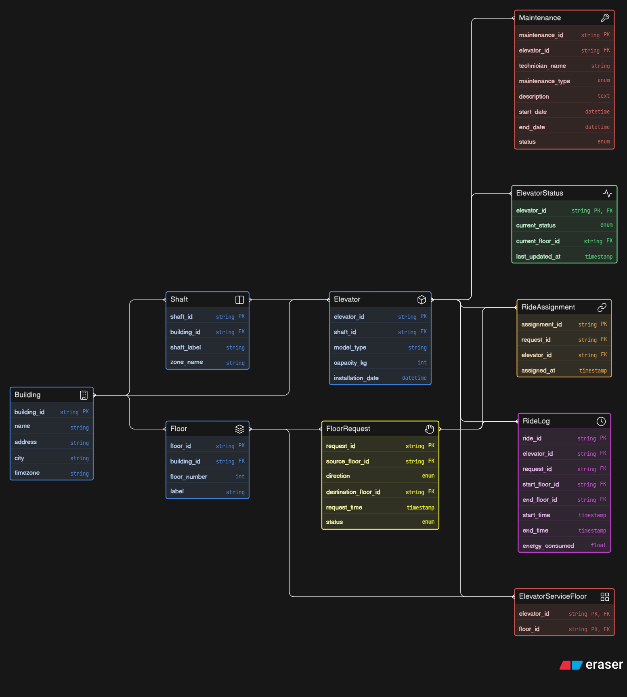

# 🚀 Smart Elevator Control System (ERD)

A scalable database design for an intelligent elevator control platform used in large infrastructure environments like corporate towers, malls, airports, hospitals, and residential complexes.

This system models real-time elevator operations, request handling, ride tracking, and maintenance management across multiple buildings.

---

## 📌 Overview

LiftGrid Systems manages:

- Multiple buildings
- Multiple elevators per building
- Floor-level request tracking
- Smart elevator assignment
- Ride history logging
- Maintenance tracking
- Real-time elevator status monitoring

---

## 🏗️ ER Diagram

---

## 🧩 Core Entities

### 🏢 Building
- Stores building-level information
- One building contains multiple floors, shafts, and elevators

### 🏬 Floor
- Represents floors inside a building
- Generates elevator requests

### 🛗 Shaft
- Physical structure where an elevator operates
- One shaft contains one elevator

### 📦 Elevator
- Core entity representing each lift
- Connected to shaft and serves multiple floors

### ⚙️ ElevatorStatus
- Tracks real-time status (idle, moving, maintenance)
- Also stores current floor and last update time

### 🔗 ElevatorServiceFloor
- Bridge table for many-to-many relation
- Defines which elevator serves which floors

### ✋ FloorRequest
- Created when a user requests an elevator
- Includes source floor, destination, direction, and status

### 🔄 RideAssignment
- Maps requests to elevators
- Handles allocation logic

### ⏱️ RideLog
- Stores completed ride data
- Used for analytics and performance tracking

### 🛠️ Maintenance
- Tracks elevator maintenance history
- Ensures safety and uptime

---

## 🔗 Relationships

- One **Building** has many **Floors, Shafts, Elevators**
- One **Shaft** has one **Elevator**
- One **Elevator** serves many **Floors** (via ElevatorServiceFloor)
- One **Floor** can be served by multiple **Elevators**
- One **Floor** generates many **Requests**
- Each **Request** is assigned to one **Elevator**
- One **Elevator** handles many **Rides**
- Each **Ride** is logged in **RideLog**
- One **Elevator** has many **Maintenance records**
- Each **Elevator** has a **Status**

---

## ⚡ Key Features

- ✅ Multi-building scalable architecture  
- ✅ Real-time elevator request handling  
- ✅ Efficient ride allocation system  
- ✅ Maintenance history tracking  
- ✅ Analytics-ready ride logs  
- ✅ Proper normalization and relationships  

---

## 🎯 Use Cases

- Smart building management systems  
- Elevator optimization platforms  
- Infrastructure analytics dashboards  
- Facility monitoring tools  

---
